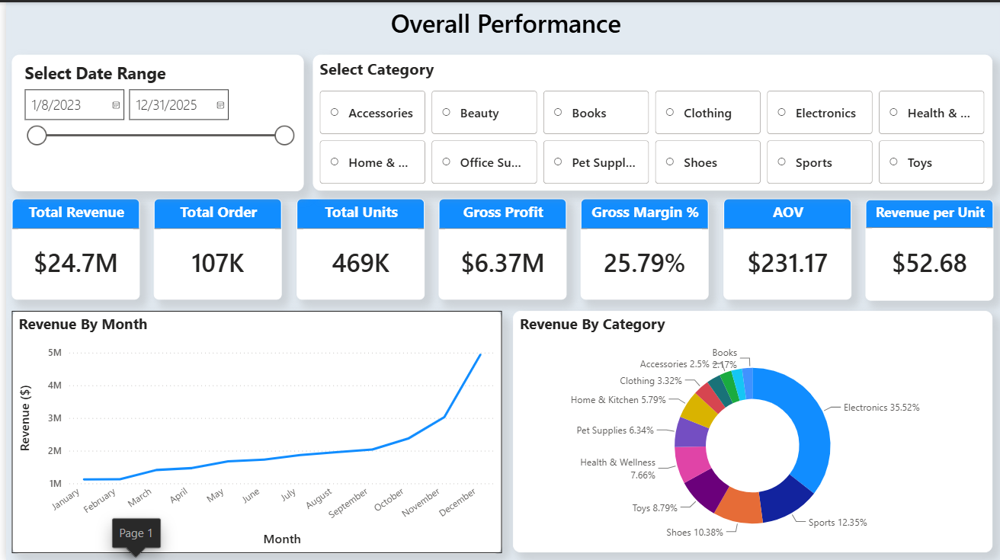
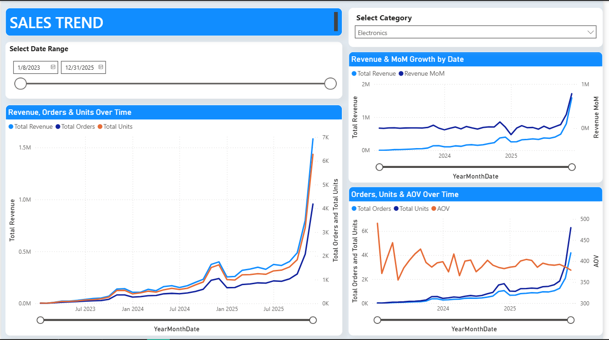

# NovaMart Ecommerce Analytics

An end-to-end **data analysis and business intelligence portfolio project** built to investigate NovaMart's ecommerce performance across sales, products, customers, payments, and returns.

The project uses a structured medallion architecture (base → clean → mart) to prepare reliable, analysis-ready data. The main focus of the project is **turning business requirements into SQL analysis, actionable findings, and Power BI dashboards**.

---

## Business Context

NovaMart is a fictional online retail company selling products across multiple cities. Management wants a consolidated view of business performance to understand:

- How sales are performing over time
- Which products and categories are driving revenue and sales volume
- How customer segments and cities contribute to performance
- Where payment activity may indicate operational issues
- Where returns may reveal product or customer-experience problems

The central business question is:

> **"What is driving our sales performance, where are we experiencing problems, and what areas should management prioritize for improvement?"**

The full business request is available in [`Docs/business_request.md`](Docs/business_request.md), while [`Docs/Business Questions.txt`](Docs/Business%20Questions.txt) contains the detailed analytical questions.

---

## Project Objective

This project follows a practical **business analytics workflow**:

**Business Request → Business Questions → Data Exploration → Data Preparation → SQL Analysis → KPI Development → Power BI Reporting → Business Insights**

The goal is not simply to query the data, but to use analysis to answer business questions and communicate the results clearly to decision-makers.

---

## Architecture

The project retains a medallion-style data architecture to provide a reliable foundation for the analysis:

```text
base (raw)
    ↓
clean (validated / standardized)
    ↓
mart (analytics-ready)
    ↓
analysis (SQL business questions)
    ↓
Power BI (dashboard & reporting)
```

### Data Layers

- **`ecommerce.base`** — raw source tables covering customers, orders, order items, products, payments, returns, categories, regions, stores, and dates.
- **`ecommerce.clean`** — cleaned, standardized, and deduplicated data used as the trusted analytical foundation.
- **`ecommerce.mart`** — denormalized, analysis-ready fact tables designed around clear business grains.
- **Analysis notebooks** — SQL analysis used to answer the defined business questions.
- **Power BI** — final reporting layer used to communicate KPIs, trends, comparisons, and business findings.

> **Why keep the architecture?**  
> A reliable analysis starts with reliable data. The engineering-style layers are used here as supporting infrastructure; the primary outcome of the project is the **business analysis and reporting built on top of that foundation**.

---

## Data Model

The source data covers:

- Customers
- Orders
- Order line items
- Products
- Payments
- Returns
- Categories
- Regions
- Stores
- Date

The full column-level data dictionary, including business definitions and known data-quality caveats, is available in [`data/data_dictionary.csv`](data/data_dictionary.csv).

A visual overview of the business problem and how the domains connect is available in [`Docs/Mind Map.drawio`](Docs/Mind%20Map.drawio).

---

## Data Exploration & Preparation

Before answering the business questions, the project investigates the structure and quality of the source data.

The exploratory notebooks cover:

- Table structure, row counts, keys, and duplicates
- Missing and null values
- Categorical inconsistencies
- Payment and return status issues
- Numeric ranges and potential outliers
- Date logic and invalid date relationships
- Early exploration of revenue trends and category mix

These checks helped identify issues that could affect the accuracy of downstream analysis.

### Data Cleaning

`notebooks/Data_Cleaning/Cleaning.ipynb` prepares the analytical dataset by addressing issues such as:

- Customer duplicates
- Inconsistent city names
- Missing city and brand values
- Missing shipping methods
- Payment method spelling/casing inconsistencies
- Return reason inconsistencies
- Invalid date relationships

Post-cleaning validation queries are used to confirm that fixes were applied without unintended row loss.

---

## Analytical Data Marts

Four analysis-ready fact tables are created in `notebooks/Marts/`:

| Notebook | Table | Business Grain |
|---|---|---|
| `fct_sales_flat.ipynb` | `ecommerce.mart.fct_sales_flat` | One row per order line item |
| `fct_orders_flat.ipynb` | `ecommerce.mart.fct_orders_flat` | One row per order |
| `fct_payments_flat.ipynb` | `ecommerce.mart.fct_payments_flat` | One row per payment |
| `fct_returns_flat.ipynb` | `ecommerce.mart.fct_returns_flat` | One row per return |

These marts provide consistent grains for analysis and make it easier to calculate business metrics without repeatedly rebuilding complex joins.

A consistent `is_completed` flag (`order_status = 'Completed'`) is used throughout the analysis to keep KPI definitions consistent.

---

# Business Analysis

The core of the project is the SQL analysis layer in `notebooks/Analysis/`.

The analysis is organized around business questions rather than technical transformations.

## 1. Sales Performance Analysis

**Notebook:** `Sales_Performance.ipynb`

Answers:

- What is the overall sales and revenue performance?
- How has revenue changed over time?
- Are there seasonal patterns?
- Which products contribute the most revenue?

Key analytical techniques include:

- Monthly trend analysis
- Month-over-month comparisons using `LAG()`
- Seasonality analysis
- Weekday vs. weekend analysis
- Holiday-period analysis
- Product revenue ranking
- Sales volume vs. revenue comparisons

**Business purpose:** Identify the major drivers of NovaMart's revenue performance and areas where performance is changing.

---

## 2. Product Performance Analysis

**Notebook:** `Product_Performance.ipynb`

Answers:

- Which products generate the highest sales volume?
- Which brands generate the most revenue?

The analysis compares product and brand performance using both **sales volume and revenue**, helping distinguish products that sell frequently from products that generate substantial revenue.

**Business purpose:** Identify high-performing products and brands and understand where product-level performance is concentrated.

---

## 3. Customer Performance Analysis

**Notebook:** `Customer_Performance.ipynb`

Answers:

- Which customer segments contribute most to performance?
- Who are the highest-value customers?
- Which cities generate the strongest performance?

The analysis uses customer segmentation, customer-level rankings, and geographic comparisons.

**Business purpose:** Understand customer contribution and identify high-value customer groups and locations.

---

# Power BI Dashboard

The SQL analysis is translated into Power BI to provide an executive-friendly view of NovaMart's performance.

The dashboard focuses on:

- Revenue and sales KPIs
- Performance trends
- Product and category performance
- Customer and geographic performance
- Payment and return indicators
- Business areas requiring attention

### Dashboard Screenshot

## Overall Performance



---

## Sales Trend




### Dashboard Design Approach

The dashboard is built **after the SQL KPI definitions are finalized** so that the numbers presented in Power BI remain consistent with the analytical logic.

The reporting layer is intended to help a manager quickly move from:

**"What happened?" → "Why did it happen?" → "Where should we focus?"**


---

# Key Analytical Outcomes

The project is designed to produce answers that can support business decisions, such as:

- Which periods are driving revenue growth or decline?
- Which products and brands are the strongest revenue contributors?
- Where is sales performance concentrated geographically?
- Which customer groups have the greatest business value?
- Are payment or return patterns indicating operational problems?
- Which areas should management prioritize?

The final Power BI report provides a visual summary of these findings so that stakeholders can explore the results without reading the underlying SQL.

---

## Data Quality & Analytical Considerations

Several data-quality findings were identified during exploration and are documented rather than hidden.

Examples include:

- Inconsistent `payment_method` spelling
- Missing `brand` and `city` values
- Invalid `birth_date` values
- Payment or return dates preceding order dates
- Potential duplication inherited from a shared date dimension
- Limitations in attributing returns to specific products for multi-item orders

These limitations are considered when interpreting the analysis.

---

## Tools

- **Databricks** — data preparation, SQL analysis, and notebook environment
- **Spark SQL** — data cleaning, analytical transformations, KPI calculations, and business analysis
- **Power BI** — dashboarding, visualization, and business reporting

The technical architecture supports the analysis, but the primary deliverables of this portfolio project are the **business questions, SQL analysis, insights, and Power BI reporting**.

---

## Repository Structure

```text
Docs/
├── business_request.md
├── Business Questions.txt
└── Mind Map.drawio

data/
└── data_dictionary.csv

notebooks/
├── Data_Cleaning/
│   └── Cleaning.ipynb
│
├── Marts/
│   ├── fct_sales_flat.ipynb
│   ├── fct_orders_flat.ipynb
│   ├── fct_payments_flat.ipynb
│   └── fct_returns_flat.ipynb
│
├── Analysis/
│   ├── Sales_Performance.ipynb
│   ├── Product_Performance.ipynb
│   └── Customer_Performance.ipynb
│
└── Exploratory_Analysis/
    ├── Structural Profiling (row counts & keys).ipynb
    ├── Missing_Null_Profiling.ipynb
    ├── Value_Domain_Checks.ipynb
    ├── Range_Outlier_Checks_on_Numeric_Fields.ipynb
    ├── Date_Logic_Check
    └── sales_performance_shape.ipynb
```

---

## Project Summary

**NovaMart Ecommerce Analytics** demonstrates an end-to-end approach to solving a realistic business analytics problem:

```text
Business Request
       ↓
Business Questions
       ↓
Data Exploration
       ↓
Data Cleaning & Validation
       ↓
Analytics-Ready Data Marts
       ↓
SQL Business Analysis
       ↓
KPI Development
       ↓
Power BI Dashboard
       ↓
Business Insights
```

The architecture provides the data foundation, while the **analysis and reporting turn that data into business insight**.
